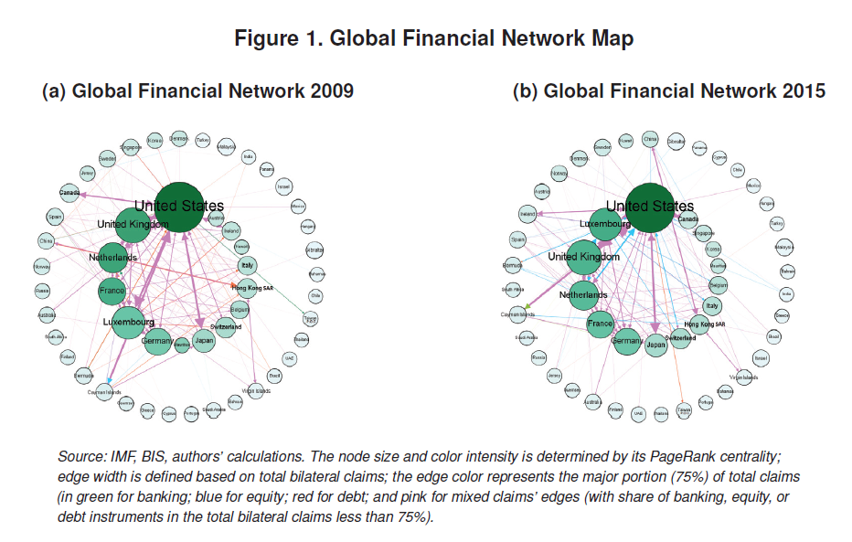
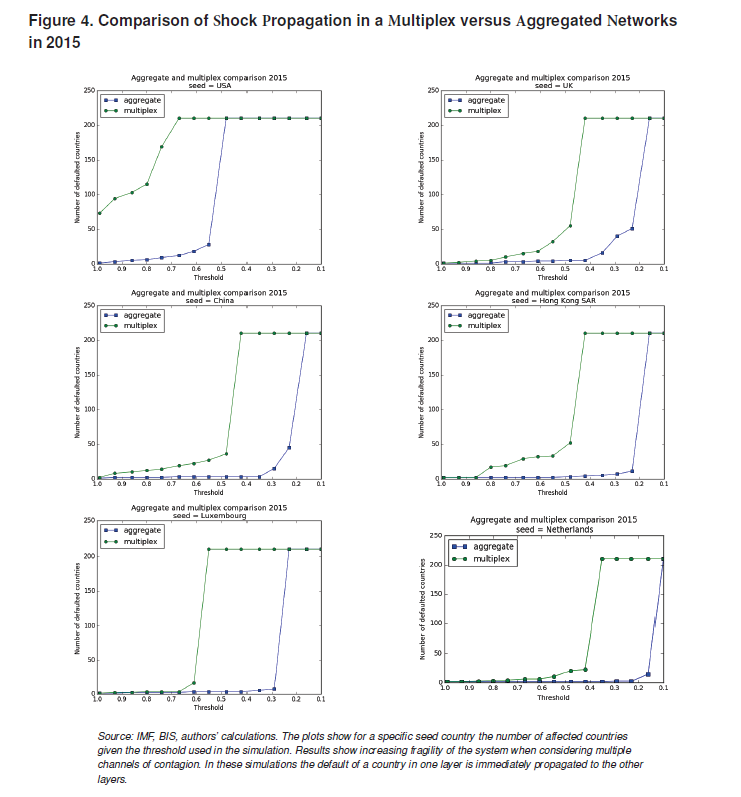
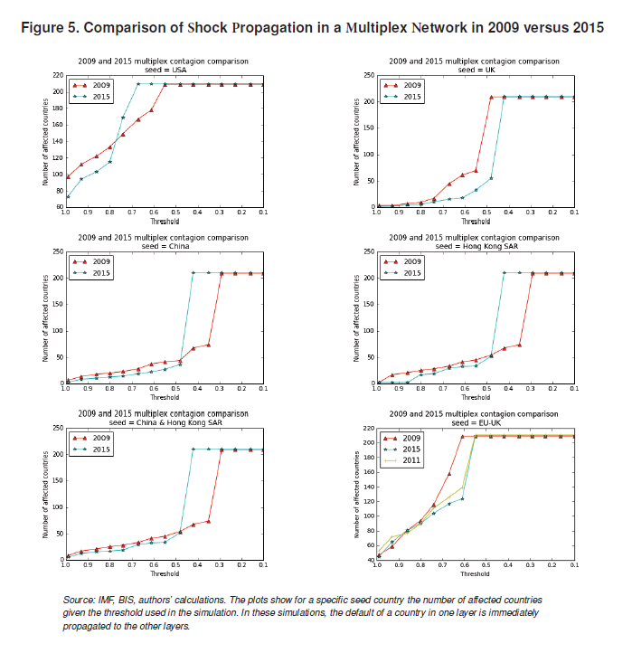
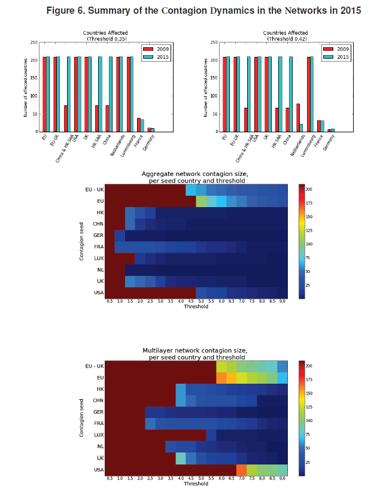

# Financial Contagion in a Multilayer Network
This is the code repository for the IMF working paper ["Financial Contagion in a Multilayer Network", by Yevgeniya Korniyenko, Manasa Patnam, Rita Maria Del Rio-Chanona, and Mason A. Porter](https://www.imf.org/en/Publications/WP/Issues/2018/05/15/Evolution-of-the-Global-Financial-Network-and-Contagion-A-New-Approach-45825)


### Setup 
```
git pull https://github.com/johnsonice/Financial_Contagion_Network.git
cd Financial_Contagion_Network
pip install -r requirements.txt
```

### Folder Structure

### Results





